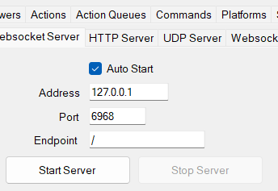

# Chat-Task-Tic Widget (Streamer Bot ver.)

---

<!-- directory -->

## Content

-   [Chat-Task-Tic Widget (Streamer Bot ver.)](#chat-task-tic-widget-streamer-bot-ver)
    -   [Content](#content)
    -   [Commands](#commands)
        -   [Moderators only](#moderators-only)
    -   [Why you should use this](#why-you-should-use-this)
    -   [Installation](#installation)
        -   [Note for YouTube Streamers:](#note-for-youtube-streamers)
    -   [Customization settings](#customization-settings)
        -   [settings](#settings)
        -   [fonts](#fonts)
        -   [scroll](#scroll)
        -   [task list](#task-list)
        -   [header](#header)
        -   [body](#body)
        -   [task (individual tasks)](#task-individual-tasks)
        -   [checkbox](#checkbox)
        -   [bullet point](#bullet-point)
        -   [colon](#colon)
    -   [Aliases](#aliases)
    -   [Credits](#credits)

---

## Commands

-   !add \<task\> - Add a task
-   !done \<task\> - Mark a task as done
-   !remove \<task\> - Remove a task
-   !edit \<task\> - Edit a task
-   !check - Check your last task

### Moderators only

-   !clear - Clear all tasks
-   !cleardone - Clear all done tasks
-   !adel @user - Remove all tasks from a user

For aliases, see [here](#aliases)

---

## Why you should use this

-   Cross Platform between YouTube and Twitch\*
-   Free
-   Easy to use
-   Easy to setup
-   Easy to customize
-   No third-party database required

\*supports simulcasting!

---

## Installation

1.  Install [Streamer.bot](https://streamer.bot/)

2.  Follow instruction video [HERE](https://youtu.be/CcXAs-qZ0Ys?t=116) on how to setup Streamer.bot \(until 5:43 timestamp\)

3.  Import StreamerBot Files `StreamerBotImport` as shown in this [VIDEO](https://youtu.be/eXn2zCu0k6k?t=298)

    -   set Auto Connect to Checked (recommended)

4.  On StreamerBot, go to `Servers/Clients` > `Websocket Server`, and change to the following settings

    

    -   Auto Start: `Checked`
    -   Address: `127.0.0.1`
    -   Port: `6968`
    -   Endpoint: `/`
    -   `Start Server`

5.  Setup `Browser Source` in OBS studio or other streaming software with the following settings:

-   Local File: `checked`
-   Browse to `index.html`

### Note for YouTube Streamers:

-   If you're adding an alt account as a bot, be sure to set alt account as moderator (/moderator @alt_account)
-   If there's some errors, try creating a channel for the alt account

---

## Customization settings

Edit `configs.js` to edit the style of the task list

---

### settings

`showDoneTasks`:

**true**: show the done tasks

**false**: hide (and remove) the done tasks

`showTaskNumber`:

**true**: show the task number (completed tasks / total tasks)

**false**: hide the task number

`crossTasksOnDone`:

**true**: cross the tasks when they are marked as done

**false**: don't cross the tasks when they are marked as done

`showCheckBox`:

**true**: show the checkbox

**false**: hide the checkbox, use bullet points instead

---

### fonts

`headerFontFamily` - font family for the header \(supports all fonts from [Google Fonts](https://fonts.google.com/) \)

`bodyFontFamily` - font family for the body \(supports all fonts from [Google Fonts](https://fonts.google.com/)\)

### scroll

`taskListScrollBehaviour` - scroll behaviour for the task list \([supports all css transition-timing-function](https://www.w3schools.com/css/css3_transitions.asp)\), linear and ease-in-out recommended

`pixelsPerSecond` - speed of the scroll in pixels per second (number)

`animationDelay` - delay of the animation in seconds (number)

---

### task list

`taskListWidth` - width of the task list (px)

`taskListHeight` - height of the task list (px)

`taskListBackgroundColor` - background color of the task list (hex only)

`taskListBackgroundOpacity` - background opacity of the task list (0: transparent, 1: opaque, 0.5: half transparent)

`taskListBorderColor` - border color of the task list (hex, name)

`taskListBorderWidth` - border width of the task list (px)

`taskListBorderRadius` - border radius of the task list (px)

---

### header

`headerHeight` - height of the header (px)

`headerBackgroundColor` - background color of the header (hex only)

`headerBackgroundOpacity` - background opacity of the header (0: transparent, 1: opaque, 0.5: half transparent)

`headerBorderColor` - border color of the header (hex, name)

`headerBorderWidth` - border width of the header (px)

`headerBorderRadius` - border radius of the header (px)

`headerFontSize` - font size of the header (px)

`headerFontColor` - font color of the header (hex, name)

`headerPadding` - padding of the header (px)

`tasksNumberFontSize` - font size of the tasks number (px)

---

### body

`bodyBackgroundColor` - background color of the body (hex only)

`bodyBackgroundOpacity` - background opacity of the body (0: transparent, 1: opaque, 0.5: half transparent)

`bodyFontColor` - font color of the body (hex, name)

`bodyBorderColor` - border color of the body (hex, name)

`bodyBorderWidth` - border width of the body (px)

`bodyBorderRadius` - border radius of the body (px)

`bodyVerticalPadding` - vertical padding of the body (px)

`bodyHorizontalPadding` - horizontal padding of the body (px)

---

### task (individual tasks)

`numberOfLines` - number of lines for the task (number)

`usernameColor` - color of the username (hex, name) \(\"\" for twitch username color\)

`taskBackgroundColor` - background color of the task (hex only)

`taskBackgroundOpacity` - background opacity of the task (0: transparent, 1: opaque, 0.5: half transparent)

`taskFontSize` - font size of the task (px)

`taskFontColor` - font color of the task (hex, name)

`taskBorderColor` - border color of the task (hex, name)

`taskBorderWidth` - border width of the task (px)

`taskBorderRadius` - border radius of the task (px)

`taskMarginBottom` - margin bottom of the task (px)

`taskPadding` - padding of the task (px)

---

### checkbox

`checkboxSize` - size of the checkbox (px)

`checkBoxBackgroundColor` - background color of the checkbox (hex only)

`checkBoxBackgroundOpacity` - background opacity of the checkbox (0: transparent, 1: opaque, 0.5: half transparent)

`checkBoxBorderColor` - border color of the checkbox (hex, name)

`checkBoxBorderWidth` - border width of the checkbox (px)

`checkBoxBorderRadius` - border radius of the checkbox (px)

`checkBoxMarginTop` - margin top of the checkbox (px)

`checkBoxMarginLeft` - margin left of the checkbox (px)

`checkBoxMarginRight` - margin right of the checkbox (px)

`tickCharacter` - character for the tick (string)

`tickSize` - font size of the tick (px)

`tickColor` - color of the tick (hex, name)

`tickTranslateY` - translate y of the tick (px) (going upwards)

---

### bullet point

`bulletPointCharacter` - character for the bullet point (string)

`bulletPointSize` - font size of the bullet point (px)

`bulletPointColor` - color of the bullet point (hex, name)

`bulletPointMarginTop` - margin top of the bullet point (px)

`bulletPointMarginLeft` - margin left of the bullet point (px)

`bulletPointMarginRight` - margin right of the bullet point (px)

---

### colon

`colonMarginLeft` - margin left of the colon (px)

`colonMarginRight` - margin right of the colon (px)

---

## Aliases

**add task commands:**

-   `!addtask`
-   `!add`
-   `!task`
-   `!taska`
-   `!taskadd`
-   `!atask`
-   `!todo`

**delete task commands:**

-   `!taskd`
-   `!taskdel`
-   `!taskdelete`
-   `!deltask`
-   `!deletetask`
-   `!taskr`
-   `!taskremove`
-   `!rtask`
-   `!removetask`
-   `!remove`
-   `!delete`

**edit task commands:**

-   `taske`
-   `taskedit`
-   `etask`
-   `edittask`
-   `edit`

**finish task commands:**

-   `!taskf`
-   `!taskfinish`
-   `!ftask`
-   `!finishtask`
-   `!taskdone`
-   `!donetask`
-   `!finish`
-   `!done`
-   `!finished`

**check commands:** \(check last task of yourself or user\)

-   `!taskc`
-   `!taskcheck`
-   `!ctask`
-   `!checktask`
-   `!mytask`
-   `!check`

Note: You can also use it like this: `!check @user` or `!check user`

**help commands:**

-   `!taskh`
-   `!taskhelp`
-   `!htask`
-   `!helptask`
-   `!tasks`

**admin delete commands:** \(delete a task from a user\) \(mods only\)

-   `!taskadel`
-   `!adel`
-   `!adelete`
-   `!admindelete`

**admin clear done commands:** \(clear all done tasks from list\) \(mods only\)

-   `!acleardone`
-   `!admincleardone`
-   `!cleardone`

**admin clear all commands:** \(clear all tasks from list\) \(mods only\)

-   `!clearall`
-   `!allclear`
-   `!adminclearall`
-   `!adminallclear`
-   `!aclearall`
-   `!aclear`
-   `!clear`

---

## Credits

**Author:** [**@RyanPython**](https://twitch.tv/RyanPython)

<!-- contributed -->

**Contributors:**

-   [**@MohFocus**](https://twitch.tv/MohFocus) \(referenced his code [here](https://github.com/mohamed-tayeh/Task-List)\)
